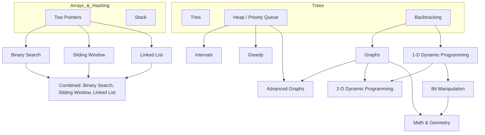

# Deets' NeetCode 150 Solutions
Solutions to the [NeetCode 150](https://neetcode.io/roadmap) problems implemented in both Python and Rust.

## Problem Categories

```mermaid
graph TD

subgraph Arrays_&_Hashing
  B1[Two Pointers]
  B2[Stack]
end

B1 --> C1[Binary Search]
B1 --> C2[Sliding Window]
B1 --> C3[Linked List]

C1 --> D[Combined: Binary Search, Sliding Window, Linked List]
C2 --> D
C3 --> D

subgraph Trees
  E1[Tries]
  E2[Heap / Priority Queue]
  E3[Backtracking]
end

E2 --> F1[Intervals]
E2 --> F2[Greedy]
E2 --> F3[Advanced Graphs]

E3 --> G1[Graphs]
E3 --> G2[1-D Dynamic Programming]

G2 --> H1[2-D Dynamic Programming]
G2 --> H2[Bit Manipulation]

G1 --> F3
G1 --> H1
G1 --> I1[Math & Geometry]

H2 --> I1
```