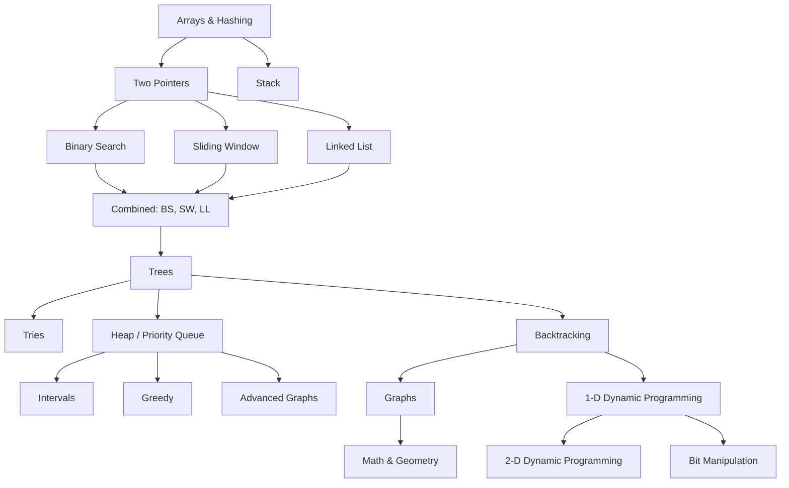

# Deets' NeetCode 150 Solutions
Solutions to the [NeetCode 150](https://neetcode.io/roadmap) problems implemented in both Python and Rust.

## Problem Categories


<!-- Link folders to graph nodes -->
%% Folder links
click A href "./arrays_hashing/"
click B href "./two_pointers/"
click C href "./stack/"
click D href "./binary_search/"
click E href "./sliding_window/"
click F href "./linked_list/"
click G href "./combined/"
click H href "./trees/"
click I href "./tries/"
click J href "./heap_priority_queue/"
click K href "./backtracking/"
click L href "./intervals/"
click M href "./greedy/"
click N href "./advanced_graphs/"
click O href "./graphs/"
click P href "./dp_1d/"
click Q href "./dp_2d/"
click R href "./bit_manipulation/"
click S href "./math_geometry/"
```